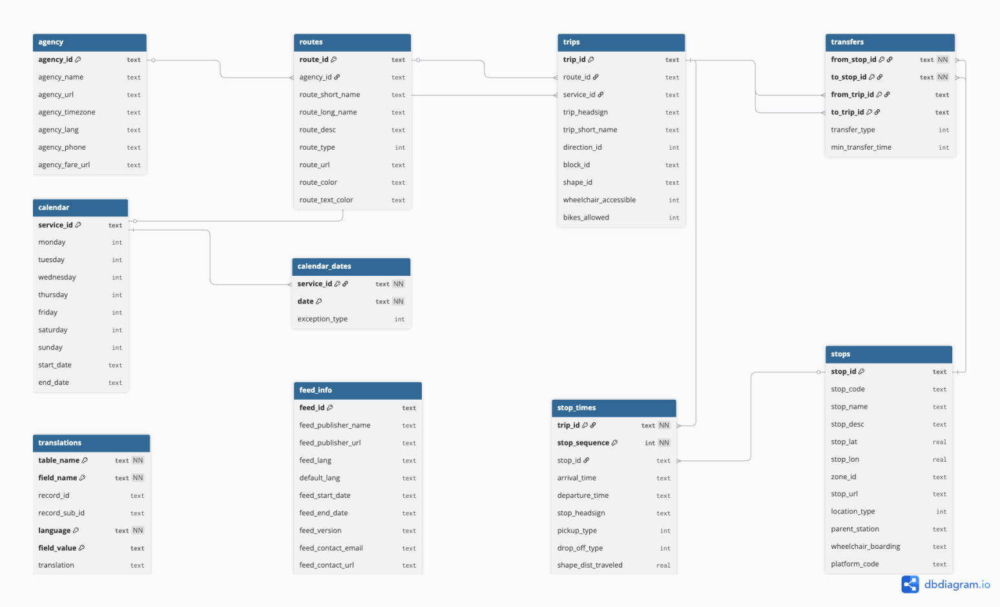

# 🚉 RailPulse: Belgian Transit SQL Analysis

SQL-based operational analysis of the Belgian National Railway (SNCB/NMBS)
network, built from the SNCB static GTFS feed. RailPulse (fictional urban
mobility consulting firm) was tasked with turning raw transit data into a
normalized SQLite database and a set of operational insights — peak-hour
load, platform bottlenecks, service frequency, and accessibility coverage
— to support winter scheduling decisions.


---

## 📋 Table of Contents

- [Project Description](#project-description)
- [Entity Relationship Diagram](#entity-relationship-diagram)
- [Tech Stack](#tech-stack)
- [Repo Structure](#repo-structure)
- [Getting Started](#getting-started)
- [Analysis Questions & Results](#analysis-questions--results)
- [Contributors](#contributors)
- [Timeline](#timeline)

---

## Project Description

**Repository:** `railpulse_sql_analysis`
**Type of Challenge:** Learning
**Duration:** 4 days

RailPulse ingests the SNCB static GTFS feed (agency, routes, calendar,
calendar_dates, trips, stops, stop_times, transfers, feed_info,
translations) via the [Belgian Mobility Open-Data Portal](https://data.belgianmobility.io/en/data.html),
loads it into a normalized SQLite database, and answers five core
operational questions using SQL only — no `pandas` or dataframe engines are
used for filtering or aggregation; Python is limited to fetching the data
(`requests`) and executing raw SQL (`sqlite3`).

**Core deliverables:**
- A normalized SQLite schema with primary/foreign keys enforced
- Clean, deduplicated data across all imported tables
- Five analytical questions answered via dedicated `.sql` files
- This README, documenting approach, schema, and findings

---

## Entity Relationship Diagram

The schema was generated using [dbdiagram.io](https://dbdiagram.io/d/6a60c481067336e1ded038ab).
An alternative tool for viewing or editing it is [drawdb](https://www.drawdb.app/).



**Design notes:**
- `routes` → `trips` → `stop_times` → `stops` forms the core operational
  chain (a route has many trips, each trip has many scheduled stops).
- `calendar` and `calendar_dates` together define *when* a `service_id` is
  active — `calendar_dates` carries day-level exceptions (added/removed
  service), which turned out to be the more reliable source for weekly
  frequency patterns in this feed (see Q4 below).
- `transfers` links stop-to-stop and trip-to-trip connections for interchange
  analysis.
- `translations` and `feed_info` are metadata tables, not part of the
  operational chain.

---

## Tech Stack

- **Database:** SQLite 3
- **Language:** Python 3 (data ingestion only — `requests`, `csv`, `sqlite3`)
- **Query layer:** Raw SQL (`.sql` files, run via the `sqlite3` CLI)
- **Schema design / ERD:** dbdiagram.io

---

## Repo Structure

```
railpulse_sql_analysis/
├── sql/                             # One self-contained query per analytical question
│   ├── 01_peak_hour.sql
│   ├── 02_platform_bottlenecks.sql
│   ├── 03_morning_destinations.sql
│   ├── 04_service_frequency.sql
│   └── 05_accessibility_audit.sql
├── src/                             # Raw GTFS static feed and its extraction notebook
│   ├── nmbssncb_static.zip          # Downloaded GTFS static feed (zipped)
│   └── sncb_static_txt_files.ipynb  # Notebook used to fetch/unzip the feed into src/data/
├── ERD.webp                         # Entity Relationship Diagram export
├── README.md
└── main.py                          # CLI: creates tables, imports GTFS data into SQLite
```

> **Note:** The unzipped GTFS CSVs (`src/data/*.txt`) and the generated
> SQLite database (`railpulse.db`, `.db-shm`, `.db-wal`) are **not** tracked
> in version control — several of these files exceed GitHub's 100MB
> per-file limit. Both are fully reproducible: run
> `src/sncb_static_txt_files.ipynb` to fetch and unzip
> `nmbssncb_static.zip` into `src/data/`, then run `main.py` to build
> `railpulse.db` from those CSVs.

---

## Getting Started

```bash
# 1. Clone the repo
git clone <repo-url>
cd railpulse_sql_analysis

# 2. Set up a virtual environment
python -m venv .venv
source .venv/bin/activate   # Windows: .venv\Scripts\activate

# 3. Install dependencies
pip install requests

# 4. Unzip the GTFS static feed into src/data/
#    Run src/sncb_static_txt_files.ipynb (or manually unzip
#    src/nmbssncb_static.zip into src/data/)

# 5. Build the database from the unzipped CSVs
python main.py
# → choose option 3: "Create tables and insert data"
```

Once `railpulse.db` exists, run any analysis query with:

```bash
sqlite3 -header -column railpulse.db < sql/<filename>.sql
```

(`01_peak_hour.sql` is the one exception — its output is two unlabeled
columns, so it's run as `sqlite3 railpulse.db < sql/01_peak_hour.sql`.)

---

## Analysis Questions & Results

### 1. The Peak Hour Problem
**Question:** What hour of the day experiences the highest volume of
scheduled train departures across the entire network?

```bash
sqlite3 railpulse.db < sql/01_peak_hour.sql
```

**Result** (hour | departure count):

```
10|139071
9|135851
11|135156
12|131354
13|129093
8|126474
14|125563
15|117889
16|113909
17|113471
7|112928
18|112798
19|110299
20|110284
21|109585
22|105451
6|83442
23|74074
5|34173
0|29885
1|7973
4|5941
2|805
3|50
```

**Takeaway:** Departures peak at **10:00**, with a broad plateau from roughly
07:00–21:00. Overnight hours (1:00–4:00) see almost no scheduled departures.

---

### 2. Platform Bottlenecks
**Question:** Identify the top 3 busiest platforms in Brussels-Central.

```bash
sqlite3 -header -column railpulse.db < sql/02_platform_bottlenecks.sql
```

**Result:**

| platform_code | departure_count |
|---|---|
| 3 | 11,982 |
| 4 | 10,515 |
| 2 | 7,473 |

---

### 3. Busiest Morning Destinations
**Question:** Find the top 3 most frequent terminal destinations
(`trip_headsign`) for all morning trips that depart before 12:00:00 PM.

```bash
sqlite3 -header -column railpulse.db < sql/03_morning_destinations.sql
```

**Result:**

| trip_headsign | trip_count |
|---|---|
| Anvers-Central | 3,930 |
| Bruxelles-Midi | 3,150 |
| Louvain | 2,505 |

---

### 4. Service Frequency
**Question:** Classify each active service ID into a weekly frequency
category using a `CASE WHEN` statement:
- **5+ days/week** → "High Frequency"
- **2–4 days/week** → "Medium Frequency"
- **1 day or irregular** → "Low Frequency/Special"

Show the percentage of services in each category.

```bash
sqlite3 -header -column railpulse.db < sql/04_service_frequency.sql
```

**Result:**

| frequency_category | service_count | percentage_share |
|---|---|---|
| Low Frequency/Special | 46,978 | 91.05% |
| Medium Frequency | 2,840 | 5.5% |
| High Frequency | 1,775 | 3.44% |

**Takeaway:** The vast majority of services in this feed are irregular or
single-day (special workings, holiday adjustments, one-off diagrams) rather
than stable weekday/weekend patterns — reflecting `calendar_dates`-driven
exception scheduling more than fixed weekly timetables.

---

### 5. The Accessibility Audit (Vehicle Features)
**Question:** Calculate the exact ratio and percentage of scheduled trips per
route that explicitly guarantee wheelchair accessibility or bicycle storage
(`bikes_allowed`). Which specific routes score the lowest in passenger
amenity availability?

```bash
sqlite3 -header -column railpulse.db < sql/05_accessibility_audit.sql
```

**Result** (top 15 routes by trip volume):

| route_short_name | route_long_name | total_trips | wheelchair_accessible_pct | bikes_allowed_pct | either_amenity_pct |
|---|---|---|---|---|---|
| IC | Anvers-Central — Charleroi-Central | 3,081 | 0.0 | 100.0 | 100.0 |
| S2 | Louvain — Braine-le-Comte | 2,674 | 0.0 | 100.0 | 100.0 |
| IC | Eupen — Ostende | 2,210 | 0.0 | 100.0 | 100.0 |
| S10 | Termonde — Alost | 1,782 | 0.0 | 100.0 | 100.0 |
| IC | Brussels Airport-Zaventem — Gand-Saint-Pierre | 1,734 | 0.0 | 100.0 | 100.0 |
| IC | Anvers-Central — Hasselt | 1,649 | 0.0 | 100.0 | 100.0 |
| IC | Liège-Guillemins — Knokke | 1,577 | 0.0 | 100.0 | 100.0 |
| IC | Brussels Airport-Zaventem — Mons | 1,569 | 0.0 | 100.0 | 100.0 |
| IC | Luxembourg (LU) — Bruxelles-Midi | 1,435 | 0.0 | 100.0 | 100.0 |
| IC | Bruxelles-Midi — Anvers-Central | 1,398 | 0.0 | 100.0 | 100.0 |
| S1 | Nivelles — Anvers-Central | 1,350 | 0.0 | 100.0 | 100.0 |
| EC | Rotterdam Centraal (NL) — Bruxelles-Midi | 1,191 | 0.0 | 100.0 | 100.0 |
| IC | Brussels Airport-Zaventem — Tournai | 1,167 | 0.0 | 100.0 | 100.0 |
| IC | Bruxelles-Midi — Arlon | 1,092 | 0.0 | 100.0 | 100.0 |
| IC | Lille Flandres (FR) — Anvers-Central | 1,080 | 0.0 | 100.0 | 100.0 |

**Takeaway:** Every route in this feed reports **0% wheelchair
accessibility** and **100% bike storage** availability. This uniformity
suggests the feed's `wheelchair_accessible` field may be uniformly
unset/defaulted to "no information" rather than reflecting real per-trip
accessibility data — worth verifying against the raw `trips.txt` before
treating this as a genuine amenity gap, and worth flagging to SNCB as a
potential data-quality issue rather than an actual service shortfall.

---

## Contributors

| Name | GitHub | Role |
|---|---|---|
| _[Hussein Abuammar]_ | (husseinabuammar24@gmail.com) | (https://github.com/husseinabuammar24-cloud/railpulse_sql_analysis) 
| _[Thi Lien Kim]_ | (lienkt0110@gmail.com) | (https://github.com/lienkt/railpulse_sql_analysis) 
| _[Siegried Camus]_ | (Csiegried@yahoo.fr)| (https://github.com/Siegried81/railpulse_sql_analysis_test) 

---

## Timeline

- **Day 1:** Repository setup, SNCB API access, schema design, ERD
- **Day 2:** Ingestion script (`main.py`), table creation, data import & validation
- **Day 3:** Write and test the five core analytical `.sql` queries
- **Day 4:** README write-up, visuals, `SQL&DB_theory.md`, prep for team feedback
- **Deadline:** 20/07/2026, 17:00